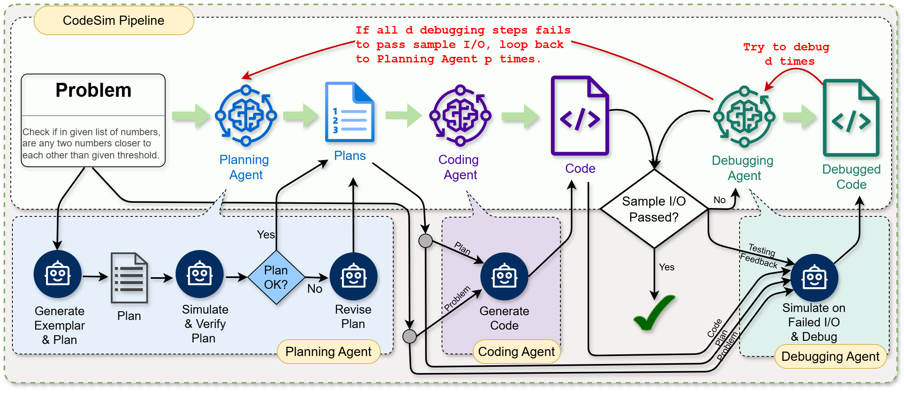
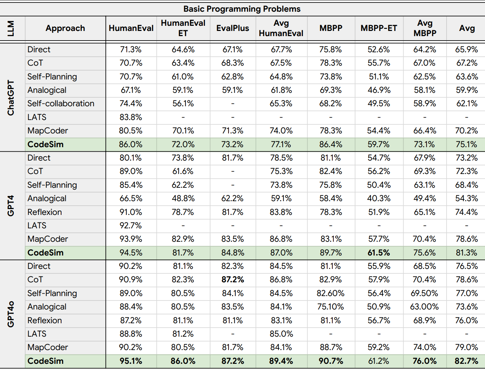
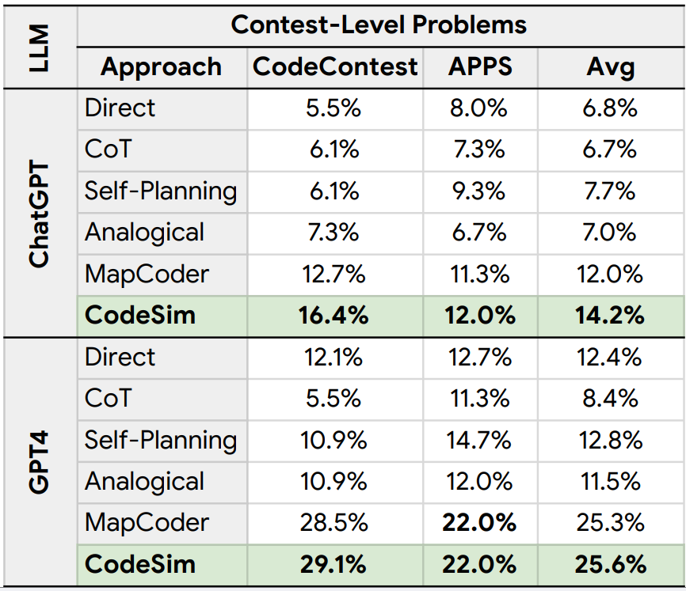
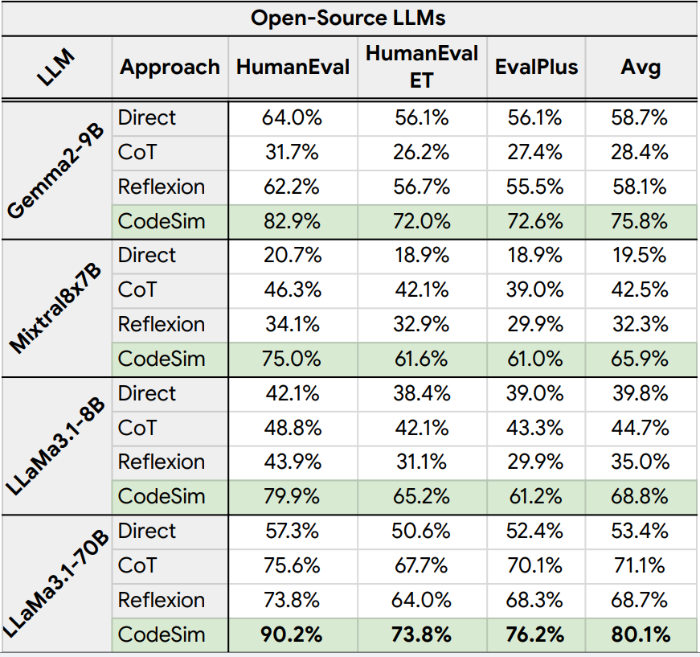

<!-- 
# Official Code Generation Repository for KagNLP 
- [Visit our webpage](https://kagnlp.github.io/codesim.github.io/)
- Visit our paper for more details -->

# CodeSIM: Multi-Agent Code Generation and Problem Solving through Simulation-Driven Planning and Debugging

<p align="center">
• 🐱 <a href="https://github.com/kagnlp/CodeGenerator" target="_blank">Code</a>
• 📃 <a href="https://arxiv.org/abs/2502.05664" target="_blank">arXiv</a>
• 🤗 <a href="https://huggingface.co/papers/2502.05664" target="_blank">Hugging face</a>
• 🌐 <a href="https://kagnlp.github.io/codesim.github.io/" target="_blank">Website</a>
</p>

## News

- 🎉 CodeSIM got accepted in NAACL 2025 Findings.
- 📢 Full results log can be found [here](https://huggingface.co/ashraful/CodeSIM/tree/main/results).
- 📢 Added CodeSIM outperforming MapCoder.
- 🎉 MapCoder got accepted in [ACL 2024](https://aclanthology.org/2024.acl-long.269/).
- 📢 All our codebase is open-sourced with MIT License.

## Abstract

Large Language Models (LLMs) have made significant strides in code generation and problem solving. Current approaches employ external tool-based iterative debuggers that use compiler or other tool-based runtime feedback to refine coarse programs generated by various methods. However, the effectiveness of these approaches heavily relies on the quality of the initial code generation, which remains an open challenge. In this paper, we introduce CodeSIM, a novel multi-agent code generation framework that comprehensively addresses the stages of program synthesis—planning, coding, and debugging—through a human-like perception approach. As human verifies their understanding of any algorithms through visual simulation, CodeSIM uniquely features a method of plan verification and internal debugging through the step-by-step simulation of input/output. Extensive experiments across seven challenging competitive problem-solving and program synthesis benchmarks demonstrate CODESIM’s remarkable code generation capabilities. Our framework achieves new state-of-the-art
(pass@1) results—**(HumanEval 95.1%, MBPP 90.7%, APPS 22%, and CodeContests 29.1%)**. Furthermore, our method shows potential for even greater enhancement when cascaded with external debuggers.

## CodeSIM Overview


Our goal is to develop a multi-agent code generation approach capable of complex problem solving. Drawing inspiration from recent works like [MapCoder](https://aclanthology.org/2024.acl-long.269/), we devise the agents in CodeSIM for planning, coding, and debugging. While these existing approaches focus primarily on expanding steps without verifying underlying hypotheses, we address this limitation by introducing a novel verification approach. Our approach simulates input/output step-by-step, verifying generated plans and performing internal debugging, mirroring how humans understand, visualize, and refine in algorithm development. Below, we present our proposed model.

### » Planning Agent

The first component of CodeSIM is the *Planning Agent*. Given a problem description, the *Planning Agent* generates a single exemplar—a relevant problem along with its plan and solution. This mimics the behavior of human programmers, who, when faced with a new problem, first recall a similar problem they've previously solved. This exemplar-based recall is crucial as it provides a starting point for constructing a solution plan. Instead of generating multiple ungrounded exemplars as in MapCoder, our agent focuses on only one at a time. We then instruct the LLM to generate an appropriate plan. Once the plan is created, the LLM simulates (step-by-step) the solution with a sample input. If the simulation result does not match the expected output, the agent prompts the LLM to revise the plan. Otherwise, the plan is deemed valid. In the case of failure, the *Planning Agent* refines the plan.

### » Coding Agent

Next component is the *Coding Agent*, which takes the problem description and the plan generated by the *Planning Agent* as input. The role of this agent is to translate the plan into executable code that solves the given problem. Once the code is generated, CodeSIM evaluates it using sample input/output test cases. If the code passes all sample tests, it is returned as the final solution. Otherwise, the code is handed over to the next agent for further refinement.

### » Debugging Agent

The final component, the *Debugging Agent*, receives the original problem, the plan from the *Planning Agent*, the code generated by the *Coding Agent*, and the execution (unit testing) log as input to debug the code. To identify bugs, instead of directly prompting the LLMs, we uniquely leverage the simulation once again. The LLM is instructed specifically to simulate the code on inputs where it fails to produce the expected output, allowing it to trace the execution step by step and locate the error. Once the bug is identified, the LLM modifies the code to resolve the issue.

## Results of CodeSIM on Seven Benchmarks







## Running our project

1. Clone our project

```
git clone https://github.com/kagnlp/CodeGenerator && cd CodeGenerator
```

2. Create a new conda or python virtual environment and run the following command

```
pip install -r requirements.txt
```

3. Set up the .env file by seeing the example.
4. Run the following command to see the options of running this projects

```
python src/main.py --help
```

5. Finally run this project. An example is given below:

```
python src/main.py --model ChatGPT --dataset HumanEval --strategy CodeSIM
```

6. To run this projects with competitive datasets you need to setup the [ExecEval](https://github.com/ntunlp/ExecEval) for docker execution. Please visit this [link](https://github.com/ntunlp/ExecEval) to setup a docker container and run it using 5000 port. Change the line 50 of the file `src\evaluations\api_comm.py` for different setup.

## Citation

```
@misc{islam2025codesim,
    title={CODESIM: Multi-Agent Code Generation and Problem Solving through 
        Simulation-Driven Planning and Debugging}, 
    author={Md. Ashraful Islam and Mohammed Eunus Ali and Md Rizwan Parvez},
    year={2025},
    eprint={2502.05664},
    archivePrefix={arXiv},
    primaryClass={cs.CL},
    url={https://arxiv.org/abs/2502.05664}, 
}

@article{islam2024mapcoder,
  title={MapCoder: Multi-Agent Code Generation for Competitive Problem Solving},
  author={Islam, Md Ashraful and Ali, Mohammed Eunus and Parvez, Md Rizwan},
  journal={arXiv preprint arXiv:2405.11403},
  year={2024}
}

@misc{parvez2021RAGCodeGen,
      title={Retrieval Augmented Code Generation and Summarization}, 
      author={Md Rizwan Parvez and Wasi Uddin Ahmad and Saikat Chakraborty and Baishakhi Ray and Kai-Wei Chang},
      year={2021},
      eprint={2108.11601},
      archivePrefix={arXiv},
      primaryClass={cs.SE},
      url={https://arxiv.org/abs/2108.11601}, 
}
@misc{khan2023xcodeeval,
      title={xCodeEval: A Large Scale Multilingual Multitask Benchmark for Code Understanding, Generation, Translation and Retrieval}, 
      author={Mohammad Abdullah Matin Khan and M Saiful Bari and Xuan Long Do and Weishi Wang and Md Rizwan Parvez and Shafiq Joty},
      year={2023},
      eprint={2303.03004},
      archivePrefix={arXiv},
      primaryClass={cs.CL},
      url={https://arxiv.org/abs/2303.03004}, 
}

```
